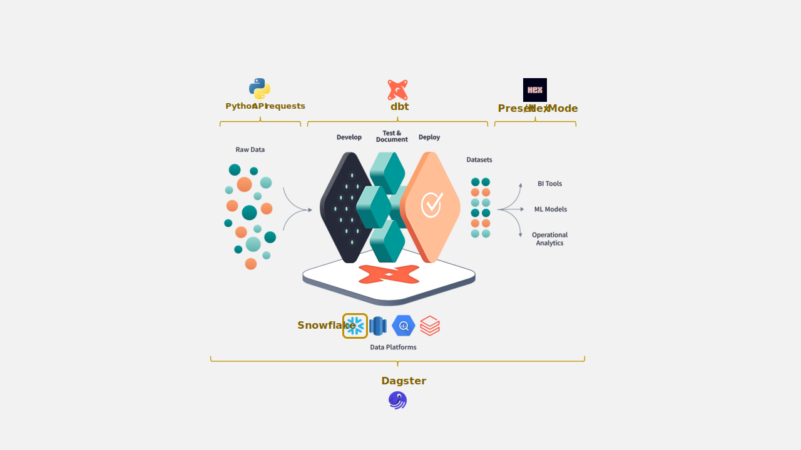

# Data solution for analyzing football events
 

> **Warning**
 
> This repo is still under development
 
  

## Introduction
This project aims to collect some football data and transform into a model that could be consumed for analytics efforts downstream.
  

## Goal
The aim of this project is to learn a set of tools to expand my knowledge across the data stack. Tools and frameworks that I plan on using: 
* dagster
* dbt 
* Hex
  

## Architecture
